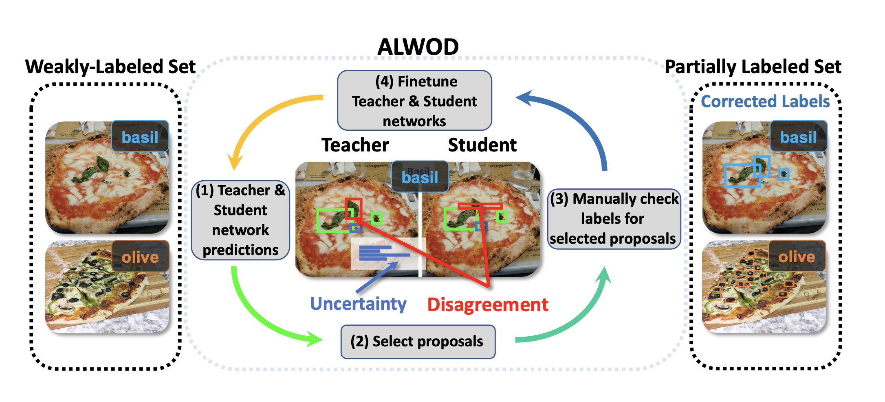

## ALWOD: Active Learning for Weakly-Supervised Object Detection

    Yuting Wang1&emsp;
    Velibor Ilic2&emsp;
    Jiatong Li1&emsp;
    Branislav Kisacanin2,3&emsp;
    Vladimir Pavlovic1&emsp;

    1Rutgers University
     
    2The Institute for Artificial Intelligence Research and Development of Serbia
    	 
    3Nvidia Corporation

Abstract:

Object detection (OD), a crucial vision task, remains challenged by the lack of large training datasets with precise object localization labels. In this work, we propose ALWOD, a new framework that addresses this problem by fusing active learning (AL) with weakly and semi-supervised object detection paradigms. Because the performance of AL critically depends on the model initialization, we propose a new auxiliary image generator strategy that utilizes an extremely small labeled set, coupled with a large weakly tagged set of images, as a warm-start for AL. We then propose a new AL acquisition function, another critical factor in AL success, that leverages the student-teacher OD pair disagreement and uncertainty to effectively propose the most informative images to annotate. Finally, to complete the AL loop, we introduce a new labeling task delegated to human annotators, based on selection and correction of model-proposed detections, which is both rapid and effective in labeling the informative images. We demonstrate, across several challenging benchmarks, that ALWOD significantly narrows the gap between the ODs trained on few partially labeled but strategically selected image instances and those that rely on the fullylabeled data.

This is the PyTorch code of the <a href="https://arxiv.org/abs/2309.07914">ALWOD paper</a>. 